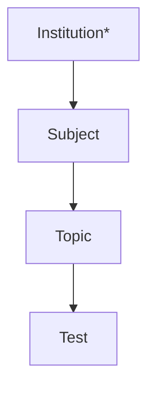

# iTesty (verze 1.0.0 beta) - softwarová dokumentace

**Autor:** Matěj Bartoň

## 1. Shrnutí

Tento dokument popisuje softwarovou část vývoje aplikace iTesty. Tato webová aplikace byla vytvořena primárně jako semestrální práce z předmětu Základy webových aplikací. Sekundární motivací bylo mé současné studium na Pražské konzervatoři. Aplikace slouží k podpoře výuky tím, že umožňuje sdílení probíraného učiva mezi studenty/uživateli aplikace formou testových otázek. Na základě uživatelských požadavků je pak schopna vygenerovat testy a tím umožnit uživatelům, aby si procvičili probíranou látku.

## 2. Zadání úlohy

Vytvořte beta verzi webové aplikace pro podporu výuky studentů. Aplikace bude založenaa na náhodném generování testových otázek, které budou vytvářet uživatelé.

### Akceptační podmínky
* aplikace musí být přístupná bez Javascriptu
* aplikace musí fungovat na nejnovějších verzích prohlížečů Chrome a Firefox
* aplikace musí mít validní html
* aplikace obsahuje přihlášení
* aplikace musí být schopna vygenerovat test z náhodných otázek
* aplikace musí umožnit uživateli, aby pohodlně nastavil parametry testu
* aplikace musí testy správně vyhodnocovat
* aplikace musí uživateli zobrazit historii jeho testů, včetně výsledků, které vyplnil
* aplikace musí uživateli umožnit, aby přidával vlastní testové otázky do databáze
* aplikace obsahuje uživatelskou příručku, která je implementována jako část webových stránek

## 3. Umístění aplikace

Aplikace je umístěna na adrese [itesty.mjvbarton.cz](https://itesty.mjvbarton.cz)

## 4. Instalace

Aplikaci rozbalíte z adresáře z gitu do kořenového adresáře webového prostoru. V adresáři *install* pak naleznete skripty v DDL, které importujete do databáze:
    * db-structure.sql
    * db-sample-data.sql

V současné fázi aplikace nepočítá s instalací na vícero serverech. 

## 5. Uživatelská příručka

Uživatelskou příručku naleznete [zde](https://itesty.mjvbarton.cz)

## 6. Souhrn použití aplikace

Při analýze úlohy jsem definoval 5 skupin uživatelů: *Guest (návštěvník stránky)*, *User (student)*, *učitele*, *správce školy* a *superuživatele*. Pro potřeby této verze budou implementovány pouze první dvě skupiny.

### Guest

Host stránek, který se může přihlásit do systému (UC001). Může číst nápovědu (UC002).


### User

Přihlášený uživatel, který si může vygenerovat nový test tím, že vybere tématický okruh testu (UC101). Poté nastaví jeho další parametry (UC102) Poté co uživatel odešle test k vyplnění je test vyhodnocen, uložen do databáze (UC103) a následně zobrazen uživateli (UC104). Uživatel si také může zobrazit historii již vygenerovaných testů (UC105) a zobrazit si je (UC104) nebo v případě, že je test nevyplní i vyplnit (UC102). Uživatel také může přidávat do databáze vlastní testové otázky (UC106). Může si také zobrazit svůj profil (UC107) a změnit heslo (UC108). Uživatel se může odhlásit (UC109)

## 7. Popis případů užití

### UC001 Přihlášení do systému

*Guest* si zobrazí hlavní stránku pro návštěvníky. Do přihlašovacího formuláře v horní části stránky zadá email, pod kterým je registrovaný v systému a své heslo. Kliknutím na tlačítko přihlášení dojde nejprve k validaci formuláře - je ověřeno, zda uživatel vyplnil email a heslo a zda data splňují maximální dělku datového typu v databázi. Validace probíhá nejdřív v klinetském prostředí v Javascriptu a poté jsou data odeslána na server, kde jsou opět zvalidována.
Pokud jsou data validní je *Guest* přihlášen do systému a stává se *Userem*. Po přihlášení je přesměrován na stránku pro generování testu.

### UC002 Zobrazení nápovědy

Po kliknutí na tlačítko nápovědy se první stránka nápovědy na. Pomocí postranního menu nebo na základě url je uživateli vykreslen soubor s daným obsahem nápovědy. Soubory jsou uloženy ve formátu Markdown a jsou převáděny pomocí externí knihovny *Parsedown* do HTML.

### UC101 Generování testu

Na začátku je uživateli zobrazena obrazovka pro výbět tématu. Uživatel si nejprve vybere předmět z menu v levém postranním panelu. Následně je uživateli v tabulce zobrazen seznam dostupných tematických okruhů. Hledaná témata může uživatel vyhledávat pomocí filtru nad tabulkou. Ten je ovládán pomocí tlačítek *Vyhledat* a *Filtr*. Kliknutí na tyto tlačítka vyvolá odeslání vyhledávacího formuláře, který překreslí stránku. V poli pro fulltextové vyhledávání je použit našeptávač, který je obsluhován pomocí AJAXem.

Výběr tématu provede uživatel zašktrnutím příslušného tématu a kliknutím na tlačítko pokračovat. Pokud téma obsahuje menší počet otázek než 5, nelze vybrat. V případě, že uživatel, žádná pole nezašktrl zobrazí se mu chybová hláška v podobě statusboxu pod titulkem stránky.

### UC102 Nastavení parametrů testu

Toto užití se aktivuje po přijetí formuláře z UC101. Uživateli zobrazena obrazovka s dalšími parametry testu. V této verzi je to pouze počet otázek, který je tvořen *dropdownem*, který zobrazí hodnotu 5 a pak všechna čísla dělitelná 10, která jsou menší než je počet ptázek a která nejsou větší než 50. Po kliknutí na tlačítko odeslat se vygeneruje nový test.

### UC103 Vyplnění testu

Na základě url je uživateli zobrazen nevyplněný test, který je tvořen otázkami. Pokud uživatel klikne na tlačítko *Opustit test* odejde z testu na zpět na UC101. Test zůstává stále uložen v databázi a jeví se jako nevyplněný. Pokud uživatel klikne na tlačítko *Vyhodnotit* je uživateli dialog, který se uživatele ptá, zda si zkontroloval odpovědi. V případě, že uživatel klikne na tlačítko *Ne* může pokračovat vyplňování, v opačném případě jsou data z testu odeslána k validaci na server. Na serveru je ověřeno, jsou odpovědi zformátovány (jsou ořezány mezery v řetězcích) a jsou přiřazeny k otázkám. Poté jsou otázky předány v vyhodnocení testu. Po vyhodnocení je uživatel přesměrován na UC104.

### UC104 Zobrazení vyplněného testu

Na základě url je uživateli zobrazen již vyplněný test. Pokud test neexistuje, je uživatel přesměrován na UC101, pokud je test nevyplněn, je uživatel přesměrován na UC103. Jsou načteny data z databáze a test je znovu vyhodnocen, a jsou zobrazeny otázky s výsledkem validace.

### UC105 Zobrazení napsaných testů

Po kliknutí na nabídku *Napsané testy* se uživateli zobrazí tabulka všech napsaných testů. V tabulce je možné vyhledávat testy podle tématického okruhu pomocí fulltextového pole. V tomto poli lze použít našeptávač, který je obsluhován AJAXem. V tabulce je také možné filtrovat testy. Kliknutím na tlačítko *Vyplnit* nebo *Zobrazit* přejde uživatel k vyplnění nebo zobrazení již vygenerovaného testu.

### UC106 Přidání testové otázky

Po kliknutí na položku nabídky *Vytvořit otázky* se uživateli zobrazí obrazovka s přidáním nových otázek. Uživatel vyplní nejprve pole pro výběr předmětu a tématického okruhu vkládané otázky. Obě pole mají našeptávač a jejich validace je prováděna přes AJAX. Uživatel poté vyplní hlavičku otázky a volitelně popis otázky. Poté uživatel zvolí z dropdown-menu, zda bude zadávat otázku s texotvým polem nebo otázku s přepínači. Poté je formulář zvalidován a otázka přidána do databáze.

### UC107 Uživatelský profil

Po kliknutí na položku nabídky *Můj profil* se uživateli zobrazí informace o jeho profilu. V současné verzi jsou to pouze jméno a příjmení uživatele, email, pod kterým je uživatel evidován a datum, kdy byl uživatel přidán do databáze. Pod uživatelským profilem je tlačítko, které umožňuje změnu hesla.

### UC108 Změna hesla

Změnu hesla provede uživatel nejprve vyplněním svého stávajícího hesla do textového pole. Poté zadá do textového pole nové heslo a do dalšího textového pole své nové heslo zopakuje. Po odeslání formuláře je ověřeno stávající heslo a následně uloženo heslo nové.

### UC109 Odhlášení

Po kliknutí na tlačítko odhlásit je uživatel odhlášen ze systému a přesměrován na úvodní stránku.

## 8. Uživatelské rozhraní

Uživatelské rozhraní je detailně popsáno v nápovědě.

## 9. Popis workflow

### W01 Přihlášení

Přihlášení je realizováno instancí třídy Login. Nejprve je ověřeno, zda se uživatelský email nachází v databázi, poté je ověřeno heslo. K šifrování hesel a k jejich ověřování se používají výchozí funkce **password_hash()** a **password_verify()**

### W02 Generování testu

Generování testu je realizováno instancí třídy iTestGenerator. Ta na základě zadaného tématického okruhu vybere otázky z databáze a z nich náhodně vybere n otázek, které uživatel zadá na vstupu. Poté instance vloží do databáze nový test a tyto vybrané otázky k němu přiřadí.

### W03 Vyhodnocení testu

Zobrazení, uchovávání a vyhodnocení testu je realizováno instancemi iTest, Question a Answer. Instance iTest nejprve načte otázky z databáze a poté je vyhodnotí. Vyhodnocení probíhá na základě porovnání řetězce (v případě textové otázky), v případě otázky s přepínači probíhá vyhodnocení na základě pořadového čísla odpovědi. Instance Question jsou obsluhovány přes spojovový seznam, který je reprezentován instancí QuestionQueue.

### W04 Uložení testové otázky do databáze

Funkce vkládání otázek je prováděna procedurálně funkcí insertQuestion. Která na základě zadaných parametrů vloží otázku do databáze. K otázce je vždy vkládán uživatelský identifikátor pro případné řešení problémů.

### W05 Změna hesla

Změna hesla je realizována instancí třídy User. Ta pomocí instance třídy Login nejprve ověří správnost původního hesla. Poté instance User pomocí vlastních metod nastaví nové heslo.

### W06 Validace formulářových polí na serveru

Validace formulářového pole je realizována pomocí instance třídy Formfield. Ta na svém vstupu přijímá parametry jako je maximální délka, název pole, to jestli je pole vyžadované atd. Při výpisu dat je možné zvolit režim escapování html tagů (výchozí nastavení) nebo toto nastavení vypnout. Třída zároveň obsahuje výchozí chybové hlášky, které je možné zobrazit pomocí view. Zároveň třída podporuje vnější validaci formulářového pole (např. při loginu).

### W07 Front controller

Celá architektura webu je řešena pomocí Front controlleru. Action controllery jsou umístěny v adresáři /assets/control. V případě, že jsou funkce action controlleru složitější, tak jsou umístěny ve složce se stejným názvem jako je název action controlleru. Modely jsou tvořeny třídami výše jmenovaných modulů. Views jsou rozděleny do adresářů podle pole působnosti. Zároveň podporují částečný composite view.

## 10. Úložiště

### Adresářová struktura

```
.
|
+-- /assets                     ** Serverová strana aplikace
|       +-- /control                    ** Action controllers
|       |       +-- /api                    
|       |       +-- /question               ** Akce pro práci s otázkami (volané z question.php)
|       |       +-- /test                   ** Akce pro práci s testy (volané z test.php)
|       |       +
|       +-- /extlib                     ** Externí knihovny
|       |       +-- /Parsedown
|       |       +
|       +-- /lib                        ** Vlastní knihovny
|       +-- /models                     ** Modely (MVC)
|       +-- /views                      ** View (MVC)
|       |       +-- /itest                  ** Rendering testů
|       |       +-- /menu                   ** Rendering uživatelských nabídek
|       |       +-- /misc                   ** Pomocné renderovací knihovny
|       |       +-- /static                 ** Statický obsah stránek
|       |       +-- /user                   ** Rendering akcí s uživatelem
|       +       +
+-- /install                    ** Instalační skripty pro databázi
|       +
+-- /resources                  ** Zdrojové materiály pro klientskou stranu
|       +-- /css
|       +-- /img
|       |       +-- /help                   ** Obrázky v nápovědě
|       |       +-- /profiles               ** Profilové fotky (v beta verzi pouze jedna defaultní)
|       |       +
|       +-- /js
|       |       +-- /ajax                   ** Knihovny pro ajax
|       |       +-- /control                ** Ovládací skript pro každý view (MVC)
|       |       +-- /misc                   ** Různé javascriptové knihovny
|       |       +
|       +-- /md                         ** Statický textový obsah stránek
|       |       +-- /help                   
|       +
+
        
```

### Databáze


Tabulky v databázi mají hierarchické uspořádání.


Tabulky **institutions** a **groups** jsou zde připraveny pro další rozšiřování aplikace.

## 11. Zabezpečení

Aplikace je zabezpečena proti XSS. Pro přístup k databázi využívá knihovnu PDO. Aplikace komunikuje s klientem přes protokol https.

## 12. Nastavení webserveru

Pro potřeby realizace front controlleru a https je upravno nastavení serveru pomocí .htaccess modulem rewrite. Přístup do adresářů assets a install je pro klienta omezen.

## 13. Zpracování dat

Data jsou zpracována pomocí modelů a jsou reprezentována v instancích tříd modelů. Každá třída zároveň obsahuje své specifické metody pro práci s daty.

## 14. Požadavky mimo rozsah projektu

Při vývoje aplikace mě napadly funkcionality, které bych rád realizoval v následujících verzích aplikace:
    * více skupin uživatelů [viz 6.](docs/README#L41)
    * systém pro evidenci špatně zadaných otázek
    * systém pro vytváření ověřených otázek vyučujícími
    * zavedení nové entity *škola*, která umožní provozovat itesty jako webový portál
    * administrátorská část aplikace pro správu uživatelů
    * registrační formulář pro uživatele

## 15. Nefunkční požadavky

### Zálohování

Zálohování zajišťuje webhosting.

### Platforma

Aplikace je vyvíjena primárně pro uživatele desktopových počítačů s prohlížeči Chrome nebo Firefox.

### Logování

V této verzi aplikace nebylo zvažováno logování.

### Chybové stavy

Chybové stavy jsou řešeny výpisem chybové hlášky do uživatelského rozhraní. V případě kritického chybového stavu (selhání sql dotazu), je uživateli zobrazena chybová stránka.

## 16. Vývojové a produkční prostředí

Pro účely vývoje aplikace bylo použito prostředí XAMPP. Po uplynutí zkouškového období bude aplikace nasazena do testovacího provozu mezi studenty Pražské konzervatoře.

V případě ostrého provozu bude dobré zvážit vytvoření separátního serveru pro účely testování.

## 17. Zajímavosti v kódu

Pro účely hodnocení semestrální práce jsem zařadil na závěr tuto kategorii.

### Zajímavost v Javascriptu

Nerealizována

### Zajímavost v CSS
* Animace chybových hlášek
* Animace dialogu

### Zajímavost v PHP
* Aplikace je z větší části v OOP
* Validace formulářových polí probíhá ve mé vlastní knihovně
* Pro zobrazení rozsáhlého statického obsahu používá knihovnu Parsedown pro převodu souborů ve formátu Markdownu na html.
        